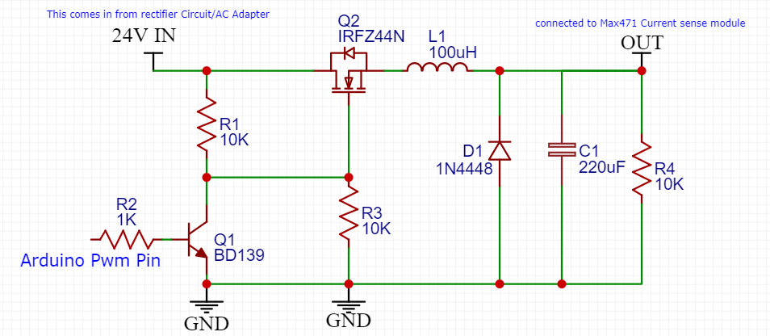
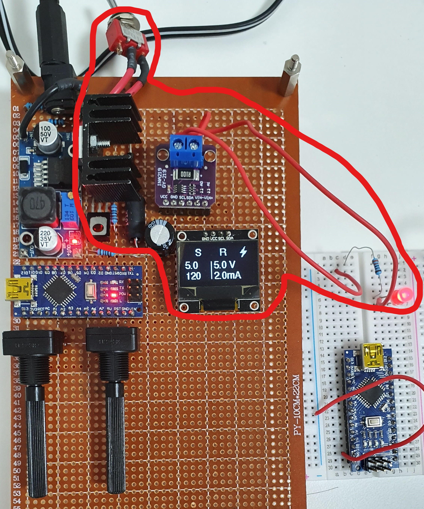
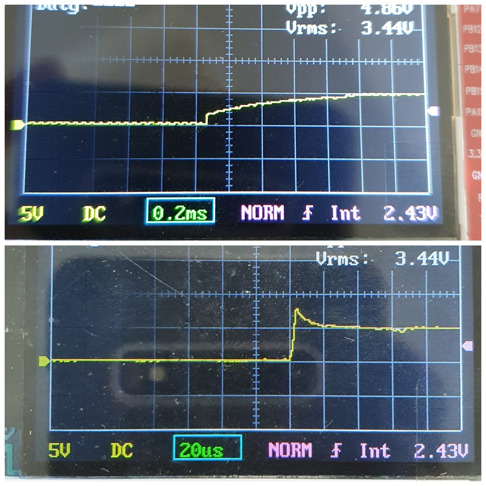

# **Switch Mode Power Supply with current limit wiki**  
Welcome, the goal of this project is to build a practical power supply for electronics. 
**Learning Goals**
1. Transistors and mosfets, buck converters, Rectifiers.
2. Switch mode (PWM) power supplys, flywheel circuit.
3. How to smooth out a PSU output.
### Requirements:
1. Voltage output from range **1.8V to 15V**, which is most suitable for electronics projects.
2. **Limited current** feature, to protect smaller devices and mistakes can be forgiving.
3. One terminal.
4. Small can compact, safe to use at the same time.

### Approach
We want to have our own current limiting feature that is why we need control of the PWM signal in the switching circuit.

Thus, my approach is using switch mode buck converter with feed back current and voltage. 
BY controlling the duty cycle of a PWM signal using Arduino, any voltage within our range can be achieved. 
Example for 10V input:
1. 50%dc, Average = 5V 
2. 10%dc, Average = 1V
3. 90%dc, Average = 9V 

Another problem is current draw,it is not ideal to use a transister to do the switching due to its low current ratings and resistance.
A mosfet is suitable for the project because the resisance of VGS is almost 0 when a high voltage is fed to the gate.
Resulting in minimal power lose.

### Implementation
Things to consider:
1. How much input voltage do we need.
2. What is the output voltage/current do we want.
3. Is the output voltage well regulated?
4. Is the output voltage accurate?

**Schematic for the project:**  

**Prototype/Product:**

The red circled area is the switching part of the circuit like shown in the schematic.  
Switches are also added to turn the output ON/OFF when the PSU is on. 
There is a additional buck converter on the left to power the 5V arduino, also 2 potentiometer below to the set voltage and current limit. 
**Testing and future improvements:**

